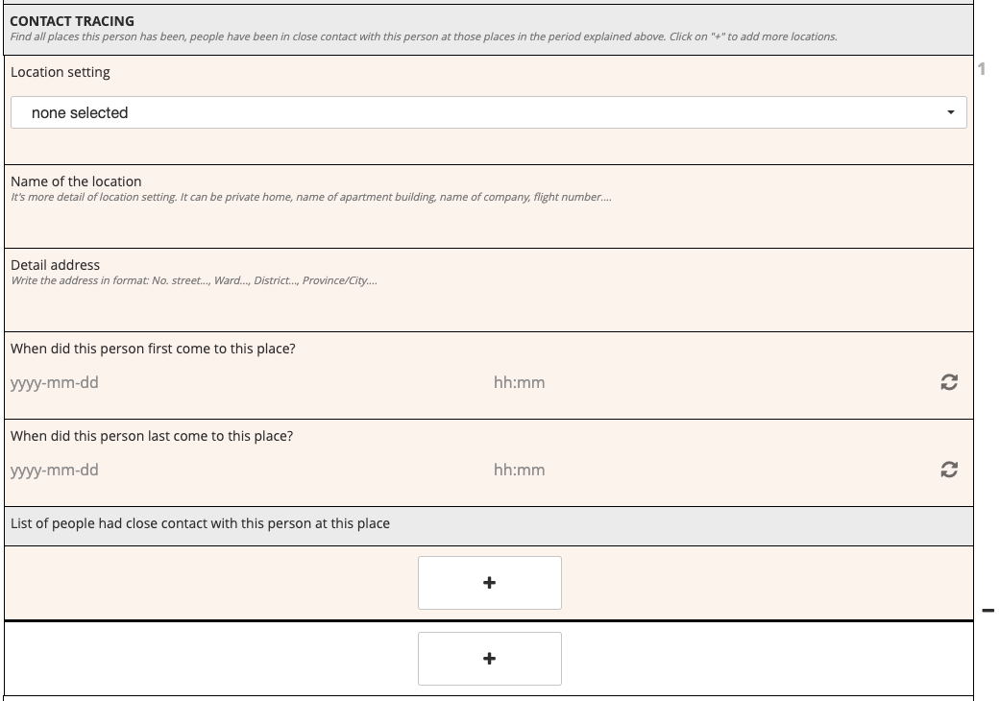
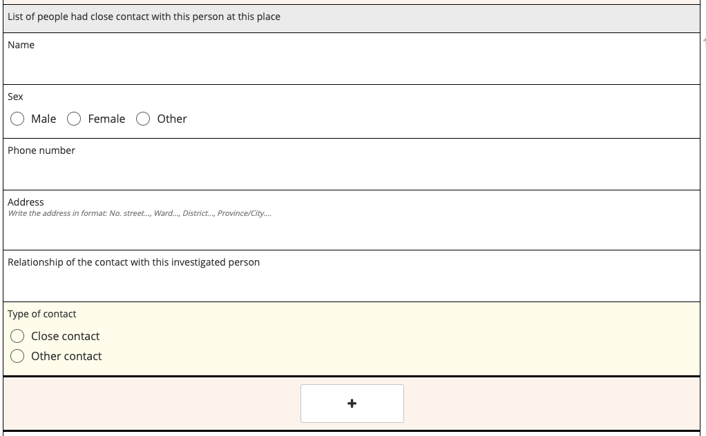
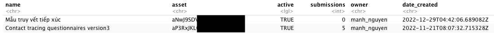
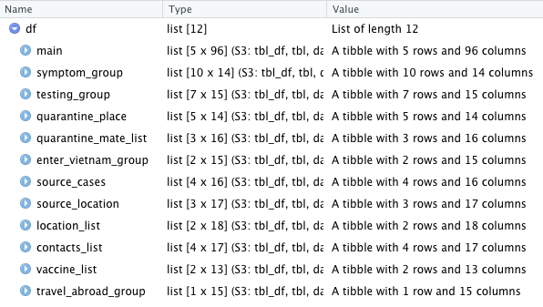
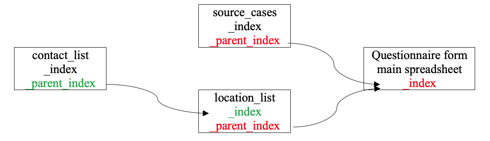
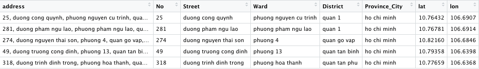

```{r setup, include=FALSE, message= F}
knitr::opts_chunk$set(echo = TRUE)
library(KoboconnectR) 
library(tidyverse)
```
## Introduction to the questionnaire form
The questionnaire form for contact tracing includes 11 rosters (repeating groups of questions). For example, there are two questions for symptoms: type of symptoms and symptom onset date. These two questions are within a roster and can be added(repeat) by clicking to “+” button.

There is a roster within another roster. It is called nested repeat. For example: In the contact tracing section. Firstly, we find all the locations where the case has been during the period that needs to be investigated. At each location, we need to find all of the contacts. We can click the first “+” button to add contacts and the second “+” button to add more locations. It means the roster contacts within the roster location.

{align=center}
{align=center}

In this tutorial, the KoboconnectR package will be used to download data. The values in the data set downloaded from this package will be in character type only. Another package can download data and keep the same format as it is in KoboToolbox is under development and will come soon.
 
## Download data
__Step 1:__ Get API from KoboToolbox with fuction kobotools_api
```{r, eval = FALSE}
library(KoboconnectR)
kobotools_api(url="kf.kobotoolbox.org", simplified=T, uname="your user name", pwd="your password")
```
 The result will give a table as below. Each row is each project you have in KoboToolbox. Column asset is the API to download data from the project appropriately
 
{align=center}

__Step 2:__ Use function kobo_xls_dl to download data to R with the API got from above.   
```{r, eval = F}
df <- kobo_xls_dl(url="kf.kobotoolbox.org", uname = "your user name", pwd = "your password",
  assetid = "API from asset column", all = "false", lang = "_xml", multi_sel = "both", sleep = 3)
```
df will be a list of 12 elements. The first element is the main spread sheet, the other 11 elements are 11 rosters in the form.

{align=center}

```{r, include=F}
df <- readRDS("df.rds") #An example data
names(df)[1] <- "main" #Normally the main spread sheet has the name of the project
```
```{r}
glimpse(df["main"])
glimpse(df["location_list"])
glimpse(df["contacts_list"])
```


In order to understand, how data is stored we can visualize the schema and relationship between elements(tables)
{align=center}
Read more about KoboToolbox [here](https://support.kobotoolbox.org/group_repeat.html) and about KoboconnectR package [here](https://github.com/asitav-sen/KoboconnectR)

## Transform data for the app
In this tutorial, I will manipulate and join the tables to make the data ready for the app.

__Step 1:__ Use tidygeocoder package to get GPS from the address
```{r, eval = F}
main <- df[["main"]]%>%
  mutate(Street = str_c("duong", Street, sep = " "), #"duong" is street
         Ward = str_c("phuong", Ward, sep = " "), #"phuong" is ward
         District = str_c("quan", District, sep = " "))%>% #"quan" is district
  unite("address", No:Province_City, sep = ", ", remove =F, na.rm = TRUE)%>% #unite columns to get full address column
  tidygeocoder::geocode(address, method = 'arcgis', lat = lat , lon = lon) # get longitude and latitude from the address
```
{align=center}

__Step 2:__ Manipulate symptom table to wide format
```{r}
df1 <- df[["symptom_group"]]%>%rename("parent_index" = "_parent_index")%>%
  select(6, 1:3)%>%mutate(parent_index = as.character(parent_index),
                          Symptoms_onset_date = as.Date(Symptoms_onset_date))%>%
  group_by(parent_index)%>% mutate(symptom = as.character(row_number()))%>% 
  ungroup()

symptom <- df1%>%
  pivot_wider(names_from = symptom, values_from = c(Type_of_symptoms, Other_symptoms, Symptoms_onset_date))
```

__Step 3:__ Manipulate testing table wide format. Get the first positive test and the last negative test before the first positive test
```{r, collapse=F}
df1 <- df[["testing_group"]]%>%rename("parent_index" = "_parent_index")%>%
  select(7, 1:4)%>%mutate(parent_index = as.character(parent_index),
                          Test_date = as.Date(Test_date))%>%
  group_by(parent_index)%>% mutate(test = as.character(row_number()))%>% 
  ungroup()

testing <- df1%>%
  pivot_wider(names_from = test, values_from = c(Test_date, Test_place, Type_of_the_test,Test_result))

## Get last negative test
testing <- rename(testing, id = parent_index) 
extract_lastneg <- function(data,id="parent_index",result.name="Test_result",date.name="Test_date"){
           tmp1 <- data %>% select(c(id, starts_with(result.name)))
           tmp2 <- data %>% select(c(id, starts_with(date.name)))
           tmp1 <- tmp1 %>% pivot_longer(!id,values_to="result",values_drop_na=FALSE)
           tmp2 <- tmp2 %>% pivot_longer(!id,values_to="date",values_drop_na=FALSE) %>% mutate(date=as.Date(date))
           out <- data.frame(id=factor(tmp1$id,levels=unique(tmp1$id)), date=tmp2$date, result=tmp1$result)
           out <- out[!(is.na(out$date)&is.na(out$result)),]
           out.id <- out %>% group_by(id) %>%  slice(1) %>% filter(result=="negative")
           out <- out %>% filter(id %in% out.id$id)
           pos <- out %>% group_by(id) %>% filter(row_number()==match("positive",result)-1)%>%select(1,2)
           names(pos) <- c(id,"last_neg_date")
           pos$id <- as.character(pos$id)
           pos
} #function to get last negative test before the first positive test

last_negative <- (extract_lastneg(testing,"id","Test_result","Test_date"))
testing <- left_join(testing, last_negative)

## Get first positive test
first_positive <- function(x) {
  first(which(x == "positive"))
} #function to get first positive test

PCR1.pos <- testing %>% 
  select(id, starts_with("Test_date"), starts_with("Test_result"))%>% 
  rowwise()%>% 
  mutate(PCR1.pos = ifelse(!is.na(Test_result_1),magrittr::extract(c_across(Test_date_1:Test_date_2), first_positive(c_across(Test_result_1:Test_result_2))), NA)) %>% 
  mutate(PCR1.pos = as.Date(PCR1.pos, origin = "1970-01-01")) %>% 
  select(PCR1.pos)
  testing <- cbind(testing, PCR1.pos)%>%rename(parent_index = id)
```
__Step 4:__ Extract the first exposure date and the last exposure date
```{r}
df1 <- df[["source_cases"]]%>%select(8, 1, 4, 5)%>%
  rename("parent_index" = "_parent_index")%>%
  mutate(parent_index = as.character(parent_index),
         First_date_exposure = as.Date(First_date_exposure),
         Last_date_exposure = as.Date(Last_date_exposure))%>%
  group_by(parent_index)%>% mutate(no = as.character(row_number()))%>% 
  ungroup()
contact <- df1%>%
  pivot_wider(names_from = no, values_from = c(Name_ID_source, First_date_exposure, Last_date_exposure))
contact$first_exposure <- as.Date(apply(contact%>%select(starts_with("First_date_exposure")), 1, min, na.rm=T))
contact$last_exposure <- as.Date(apply(contact%>%select(starts_with("Last_date_exposure")), 1, max, na.rm=T))
```
__Step 5:__ Join all tables together
```{r, eval = F}
df1 <- main%>%rename("index" = "_index")%>%
  mutate(index = as.character(index))%>%
  left_join(symptom, by = c("index" = "parent_index"))%>%
  left_join(testing, by = c("index" = "parent_index"))%>%
  left_join(contact, by = c("index" = "parent_index"))%>%
  rename(Case_ID = Patient_code,
         ID_of_the_source_1 = Name_ID_source_1,
         ID_of_the_source_2 = Name_ID_source_2)%>%
  unite("infector", starts_with("ID_of_the_source"), sep = ",",remove= F, na.rm = T)%>% #make a column include all possible infectors
  mutate(infector = na_if(infector, ""))

df1$infector <- lapply(df1$infector, function(x) strsplit(x, ",")[[1]]) #change the format of infector column for the network


